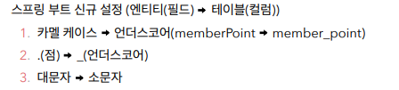
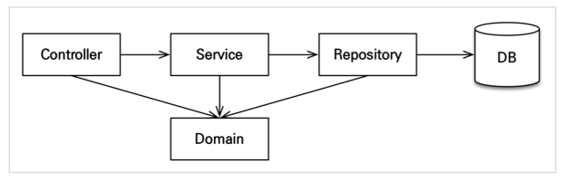

# ApplicationSpringBootJpa
***
- 프로젝트 환경설정
  - 프로젝트 생성
  - View 환경 설정
  - thymeleaf 템플릿 엔진 동작
    - spring-boot-devtools 라이브러리 이용하여 html 컴파일로 서버 재 시작 없이 View 파일 변경 가능하다.
  - JPA와 DB 설정, 동작확인
    - application.yml , Entity , Repository
- 도메인 분석 설계
  - 요구사항 분석
  - 도메인 모델과 테이블 설계
    - 엔티티를 설계할 때 JPA 에서는 다대다 관계를 사용하지 않는 것을 권장한다.
      - 다대다 관계를 일대다, 일대일 관계 등으로 풀어야 한다.
      - 가급적이면 양방향 연결을 사용하지 말고, 단방향 연결을 사용하는 것이 좋다.
      - 
    - 연관관계 매핑 분석
      - 일대다, 다대일 관계에서는 연관관계의 주인을 정해야 한다. 외래 키가 있는 것을 연관관계의 주인으로 하는 것이 좋다. 보통 Many 쪽이 연관관계의 주인, 외래 키를 가지고 있다.
      - 연관관계의 주인 쪽의 참조 속성을 연관관계의 주인 쪽의 외래 키와 매핑한다.
      - 연관관계의 주인 쪽에서 값을 변경할 수 있다. 반대 쪽은 조회만 가능하다.
      - 
    - 엔티티 클래스 개발 1
      - 실무에서는 가급적 Getter 만 열어두고 Setter 는 꼭 필요한 경우에만 사용
      - 엔티티를 변경할 대는 Setter 대신에 변경 지점이 명확하도록 변경을 위한 비즈니스 메서드를 별도 제공할 것.
      - 엔티티의 식별자는 id를 사용하고 PK 컬럼명은 member_id를 사용하는 이유는 엔티티는 타입이 있기 때문에 필드만으로 쉽게 구별이 가능하지만, 테이블은 타입이 없어서 구분이 어렵기 때문이다.
      - OneToOne 관계 같은 경우 FK를 어디에 두어도 상관이 없다. ACCESS 를 자주 하는 곳에 두는 게 좋다.
      - @ManyToOne(), @JoinColumn(name = " " ), @OneToMany(mappedBy = " ") 이런 식으로 연관관계 매핑한다.
      - FK를 가지고 있는 쪽에서 값을 넣어야 반대편이 변경될 수 있다. 연관 관계의 주인에서 값을 넣으면 변경되지 않는다.
      - @Enumerated(EnumType.String) Ordinary 로 타입을 줄 수 있으나 나중에 상태가 추가되었을 경우 크게 문제가 생길 수 있다. String 타입으로 넘겨주는 게 현명하다.
      - 상속 하는 클래스 엔티티 들의 경우
        - @Inheritance(strategy = InheritanceType.) JOINED 는 가장 정규화된 스타일이다, SINGLE_TABLE 은 한 테이블에 모두 모으는 것, TABLE_PER_CLASS 는 클래스마다 테이블로 나누는 전략
        - @DiscriminatorColumn(name = "dtype") TYPE 별로 구분해 준다.
    - 엔티티 클래스 개발 2
      - 실무에서는 다대다 관계를 거의 쓰지 않는다.
        - 필드를 추가하는 행위가 불가능하다. ( 중간 테이블에 컬럼을 추가할 수 가 없다. )
        - 세밀하게 쿼리 실행하기가 어렵다.
        - **해결방법**
          - 중간 엔티티를 따로 만들고 각각 @ManyToOne , @OneToMany 로 매핑하여 사용하면 좋다.
          - 다대다 매핑 관계를 일대다, 다대일 매핑으로 풀어서 해결한다.
      - FK 를 거는 것에는 돈이 걸린 아주 중요한 프로젝트에서 유용하다.
      - 값 타입은 변경 불가능하게 설계해야 한다. ( Setter 가 없는 상태 )
      - **엔티티 클래스를 생성해서 자동으로 생성되는 DDL 을 데이터 베이스에 그대로 사용하면 될까??**
        - 당연히 안된다. 비슷하게 사용하는 건 유용하지만 별도로 추가하거나 제거하거나 하는 과정을 거쳐야 한다. 실무에서는 자동으로 생성되는 DDL 을 참고만 한다.
    - 엔티티 설계시 주의점
      - **모든 연관관계는 지연 로딩으로 설정한다.** **중요!!** 
        - 어떤 SQL 이 실행될지 추적하기가 어렵다. 연관되어 있는 데이터를 다 가져온다 ..
        - 실무에서 모든 연관관계는 LAZY 로 설정해야 한다. @OneToOne(fetch = LAZY) @ManyToOne(fetch = LAZY)
      - 컬렉션은 필드에서 바로 초기화 하는 것이 베스트 방법이다.
        - null 문제에서 안전하다.
        - 컬렉션을 바꾸지 않는 것이 안전하다.
          - 하이버 네이트가 엔티티를 영속화할 때, 내장 컬렉션으로 변경하기 때문이다.
      - 테이블 컬럼명 생성 전략
        - 
    - 어플리케이션 구현 준비
      - 구현 요구사항
        - 로그인 기능이나 권한 같은 기능은 구현 X
      - 어플리케이션 아키텍처
        - 
    - 회원 도메인 개발
      - 회원 리포지토리 개발
        - @Repository
        - @PersistenceContext EntityManager
      - 회원 서비스 개발
        - @RequiredArgsConstructor ( final 키워드 )
        - 생성자 주입 방식
        - validation 동시성 고려하여 유니크 제약 조건 고려할 것 ( 실무 )
        - Service 단에서는 @Transactional 으로 트랜잭션 처리를 하고 조회 부분에서는 readonly 속성을 추가할 것
      - 회원 기능 테스트
        - 테스트를 진행하면서 느낀 점 : **디렉토리 구조를 잘 확인하자..** 
        - @Rollback(false) 하면 Rollback 하지 않는다.
        - 엔티티 매니저를 생성하고 @Autowired 로 등록한 이후에 em.flush()를 통해서 insert 를 할 수 있다. DB 에 영속성 컨텐츠를 보내는 것이다.
        - 그렇지만 상위에 @Transactional 이 있기 때문에 insert 가 기록만 되고 롤백된다.
        - test 환경에 resource 를 별도로 두어서 memory 환경에서 DB 테스트 가능 ( spring 에서는 기본 제공 
        - 분리하는 것이 당연하다.
    - 상품 도메인 개발
      - 상품 엔티티 개발 ( 비즈니스 로직 추가 )
        - 엔티티 안에 비즈니스 로직 가능 !
      - 상품 리포지토리 개발
      - 상품 서비스 개발
        - 상품 서비스에서 상품 리포지토리를 이용하여 DB와 소통 ( controller 에서 service 를, service 에서 repository 를 )
    - 주문 도메인 개발
      - 주문, 주문상품 엔티티 개발
        - 각각 생성 메서드, 비즈니스 로직, 조회 로직 을 별개로 만든다.
      - 주문 리포지토리 개발
      - 주문 서비스 개발
        - cascade = ALL 로 하여 persist 를 동시에 가능하게 한다.
        - service 단에서 생성 메서드를 사용하지 않고 setter 등을 이용하여 다중으로 코드가 생성되지 않도록 엔티티에서 @NoArgsConstructor(access = AccessLevel.PROTECTED) 를 추가하여 방지할 수 있다.
        - 좋은 설계와 유지보수를 위해서 코드를 제약적으로 쓰는 것이 좋다.
        - 엔티티가 비즈니스 로직을 가지고 객체 지향의 특성을 활용하는 것을 **도메인 모델 패턴**이라 한다.
        - 반대로 엔티티에는 비즈니스 로직이 거의 없고 서비스 계층에서 대부분의 비즈니스 로젝을 처리하는 것을 **트랜잭션 스크립트 패턴**이라고 한다.