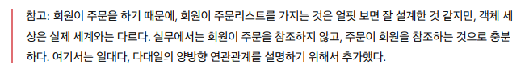
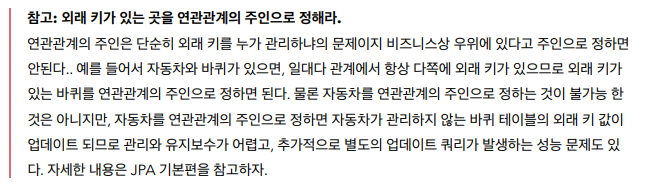

# ApplicationSpringBootJpa
***
- 프로젝트 환경설정
  - 프로젝트 생성
  - View 환경 설정
  - thymeleaf 템플릿 엔진 동작
    - spring-boot-devtools 라이브러리 이용하여 html 컴파일로 서버 재 시작 없이 View 파일 변경 가능하다.
  - JPA와 DB 설정, 동작확인
    - application.yml , Entity , Repository
- 도메인 분석 설계
  - 요구사항 분석
  - 도메인 모델과 테이블 설계
    - 엔티티를 설계할 때 JPA 에서는 다대다 관계를 사용하지 않는 것을 권장한다.
      - 다대다 관계를 일대다, 일대일 관계 등으로 풀어야 한다.
      - 가급적이면 양방향 연결을 사용하지 말고, 단방향 연결을 사용하는 것이 좋다.
      - 
    - 연관관계 매핑 분석
      - 일대다, 다대일 관계에서는 연관관계의 주인을 정해야 한다. 외래 키가 있는 것을 연관관계의 주인으로 하는 것이 좋다. 보통 Many 쪽이 연관관계의 주인, 외래 키를 가지고 있다.
      - 연관관계의 주인 쪽의 참조 속성을 연관관계의 주인 쪽의 외래 키와 매핑한다.
      - 연관관계의 주인 쪽에서 값을 변경할 수 있다. 반대 쪽은 조회만 가능하다.
      - 