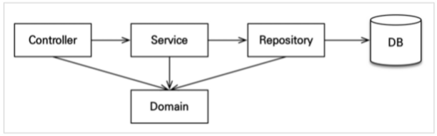

# Domain 개발

---

### 학습용 어플리케이션 아키텍처

- ## 회원 도메인 개발
    - ### 회원 리포지토리 개발
        - @Repository
        - @PersistenceContext EntityManager
    - ### 회원 서비스 개발
        - @RequiredArgsConstructor ( final 키워드 )
        - 생성자 주입 방식
        - validation 동시성 고려하여 유니크 제약 조건 고려할 것 ( 실무 )
        - Service 단에서는 @Transactional 으로 트랜잭션 처리를 하고 조회 부분에서는 readonly 속성을 추가할 것
    - ### 회원 기능 테스트
        - 테스트를 진행하면서 느낀 점 : **디렉토리 구조를 잘 확인하자..**
        - @Rollback(false) 하면 Rollback 하지 않는다.
        - 엔티티 매니저를 생성하고 @Autowired 로 등록한 이후에 em.flush()를 통해서 insert 를 할 수 있다. DB 에 영속성 컨텐츠를 보내는 것이다.
        - 그렇지만 상위에 @Transactional 이 있기 때문에 insert 가 기록만 되고 롤백된다.
        - test 환경에 resource 를 별도로 두어서 memory 환경에서 DB 테스트 가능하다. ( spring 에서는 기본 제공 )
        - 분리하는 것이 당연하다.
- ## 상품 도메인 개발
    - 상품 엔티티 개발 ( 비즈니스 로직 추가 )
        - 엔티티 안에 비즈니스 로직 가능 !
    - 상품 리포지토리 개발
    - 상품 서비스 개발
        - 상품 서비스에서 상품 리포지토리를 이용하여 DB와 소통 ( controller 에서 service 를, service 에서 repository 를 )
- ## 주문 도메인 개발
    - 주문, 주문상품 엔티티 개발
        - 각각 생성 메서드, 비즈니스 로직, 조회 로직 을 별개로 만든다.
    - 주문 리포지토리 개발
    - 주문 서비스 개발
        - cascade = ALL 로 하여 persist 를 동시에 가능하게 한다.
        - service 단에서 생성 메서드를 사용하지 않고 setter 등을 이용하여 다중으로 코드가 생성되지 않도록 엔티티에서 @NoArgsConstructor(access = AccessLevel.PROTECTED) 를 추가하여 방지할 수 있다.
        - 좋은 설계와 유지보수를 위해서 코드를 제약적으로 쓰는 것이 좋다.
        - 엔티티가 비즈니스 로직을 가지고 객체 지향의 특성을 활용하는 것을 **도메인 모델 패턴**이라 한다.
        - 반대로 엔티티에는 비즈니스 로직이 거의 없고 서비스 계층에서 대부분의 비즈니스 로젝을 처리하는 것을 **트랜잭션 스크립트 패턴**이라고 한다.