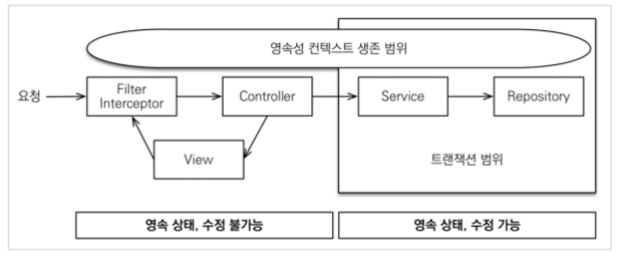
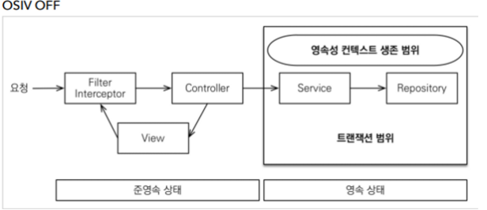

# OSIV와 성능 최적화

- Open Session In View : 하이버네이트
- Open EntityManager In View : JPA
- ## OSIV ON

- ### `spring.jpa.open-in-view : true` → 기본값
    - 이 전략은 트랜잭션 시작, 데이터베이스 커넥션 시작 시점부터 API 응답이 끝날 때 까지, **영속성 컨텍스트와 DB 커넥션을 유지한다. → 지연 로딩이 가능하다**
    - 영속성 컨텍스트는 기본적으로 데이터베이스 커넥션을 유지한다. 이것은 큰 장점이다.
    - 단점 : 너무 오랜기간 DB 커넥션 리소스를 사용하기 때문에 , 실시간 트래픽이 중요한 애플리케이션에서는 커넥션이 모자랄 수 있다. → 장애로 이어진다. ( 예를 들어, 컨트롤러에서 외부 API 를 호출하면 외부 API 대기 시간 만큼 커넥션 리소스를 반환하지 못하고 유지해야 한다. )
- ## OSIV OFF

  

- ### `spring.jpa.open-in-view: false` OSIV 종료
    - 트랜잭션을 종료할 때 , 영속성 컨텍스트를 닫고 DB 커넥션도 반환한다. 따라서 커넥션 리소스를 낭비하지 않는다.
    - OSIV 옵션을 끄면 모든 지연로딩을 트랜잭션 안에서 처리해야 한다. 따라서 지연 로딩 코드들을 트랜잭션 안으로 넣어야 하는 단점이 있다. 그리고 view template에서는 지연로딩이 작동하지 않는다. ( 이미 반환했기 때문 ) → 트랜잭션이 끝나기 전에 지연 로딩을 강제로 호출해 두어야 한다.
    - `@Transactional` 을 클래스 혹은 메소드에 붙이면 트랜잭션으로 선언되어 영속성 컨텍스트를 이용할 수 있다.
    - 계층 분리를 완벽하게 하면 OSIV를 종료해도 서비스 계층에서 모두 처리하여 진행 가능하다.
- ## 커맨드와 쿼리 분리
    - 실무에서 OSIV를 끈 상태로 복잡성을 관리하는 좋은 방법은 Command와 Query를 분리하는 것이다.
    - 보통 비즈니스 로직은 특정 엔티티를 등록하거나 수정하는 것이므로 성능이 크게 문제가 되지 않는다. 그러나 복잡한 화면을 출력하기 위한 쿼리는 화면에 맞추어 성능을 최적화 하는 것이 중요하다. ( 조회 쿼리 )
    - 크고 복잡한 애플리케이션을 만들 때는 , 핵심 비즈니스 로직과 조회에 대한 로직을 명확하게 분리하는 것이 유지보수 관점에서 중요하다.
        - OrderService : 핵심 비즈니스 로직
        - OrderQueryService : 화면이나 API 스펙에 맞춘 서비스 `@Transactional(readOnly = true)` 를 보통 이용한다. ( 지연로딩 , 영속성 컨텍스트 사용 위함 )
    - OSIV 옵션은 고객 실시간 서비스 API에서는 끄고 , ADMIN 처럼 커넥션을 많이 사용하지 않는 곳에서는 켜는 것이 좋다.